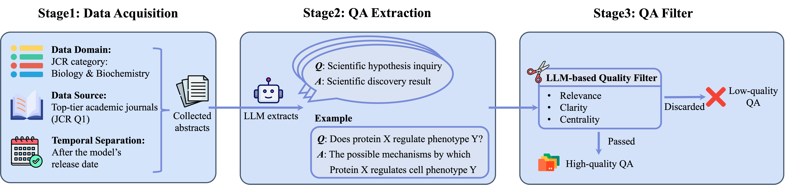
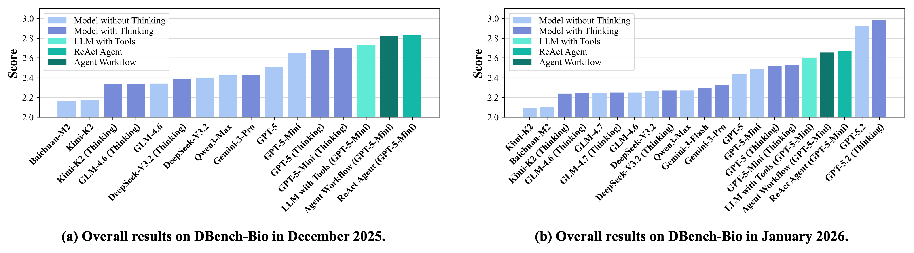
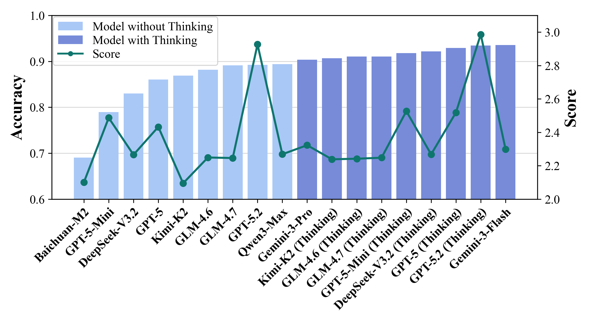

# DBench-Bio

DBench-Bio is a dynamic and fully automatic Benchmark designed to evaluate AI’s biological knowledge discovery ability. It consists of a three-stage pipeline: (1) data acquisition of rigorous, authoritative paper abstracts; (2) QA extraction utilizing LLMs to synthesize scientific hypothesis questions and corresponding discovery answers; and (3) QA filter to ensure quality based on relevance, clarity, and centrality.

	
	 
	<em>The overall pipeline of DBench-Bio.</em>

## Evaluation Results

	
	 
	<em>The overall results on DBench-Bio.</em>

We evaluate SOTA LLMs with and without thinking, with tool-using, and with agentic workflow. The results are shown in the above figure. We can conclude the following observations:

- **Low Overall Performance.** The aggregate performance across all evaluated models remains low (The maximum Score is 5). This underscores the inherent difficulty of knowledge discovery, suggesting that current LLM models have yet to master the ability to derive new knowledge.

- **Divergent Efficacy of Thinking Strategies.** Thinking strategies yield significant improvements for certain models (e.g., Kimi-K2, GPT-5, GPT-5-Mini, and GPT-5.2), but offer negligible gains for others (e.g., GLM-4.6, GLM-4.7, and DeepSeek-V3.2). This disparity indicates that different models possess varying reasoning capacities when tackling new knowledge problems. Furthermore, it implies that the utility of explicit thinking strategies is not universal but depends heavily on the model's intrinsic alignment with structured reasoning patterns.

- **Limited Utility of Tool Use.** Enabling tool use within a restricted retrieval scope failed to yield significant improvements. We attribute this to the fact that the information retrieved via tools largely overlaps with the models’ internal knowledge, thereby offering negligible information gain.

- **Effectiveness of Agent Architectures.** Both ReAct and Workflow architectures result in performance boosts. Interestingly, the performance gap between these two paradigms is marginal. This finding suggests that integrating reasoning with external tools, via either iterative planning or pre-set workflows, effectively facilitates the discovery of new knowledge.

     
	
	 
	<em>Results for base models on MMLU-Pro (Biology) (bar chart) and DBench-Bio (January 2026) (line graph).</em>

To investigate the contribution of basic biological knowledge to the discovery of new biological knowledge, we evaluate the base models on the biology task of MMLU-Pro benchmark, which offers a rigorous assessment of foundational biological literacy and textbook-level reasoning capabilities. We then compare these results with the evaluation results on DBench-Bio, as shown in the above figure. We can conclude the following observations:

- **Basic Knowledge as a Prerequisite.** The mastery of basic knowledge serves as a prerequisite for discovering new knowledge. Notably, Baichuan-M2 exhibits the poorest performance on both MMLU-Pro and DBench-Bio, suggesting that deficiencies in basic knowledge retention severely hinder the capacity for new discovery.
- **The Gap Between Memorization and Discovery.** Thinking models consistently achieve accuracy exceeding 90% on MMLU-Pro with negligible variance, indicating a robust grasp of biological basics. However, their performance on DBench-Bio remains suboptimal. This discrepancy suggests that high scores on MMLU-Pro may be artificially inflated by potential data contamination. More fundamentally, it highlights the limitations of current models in knowledge composition and complex reasoning. These findings imply that genuine knowledge discovery necessitates advanced reasoning capabilities, positioning DBench-Bio as a benchmark with superior discriminative power compared to traditional static alternatives.
- **Misalignment in Model Rankings.** We observe a misalignment in model rankings between MMLU-Pro and DBench-Bio. Despite the leading performance of Gemini-3-Flash on MMLU-Pro, its relatively inferior result on DBench-Bio suggests that high proficiency in static knowledge retention does not necessarily translate to the ability to discover new knowledge.

## Environment

- Python 3.11.13
- biopython 1.86
- evaluate 0.4.6
- openai 1.109.1
- pandas 2.3.3

## Construct Benchmark

In `benchmark.py`, set parameters such as `MAX_CONCURRENCY`, `API_KEY`, `BASE_URL`, `MODEL_NAME`, `year_month`, `ab_dir` and `output_dir`. Then run `benchmark.py` to construct the benchmark dataset. The output will be saved in the specified `output_dir` as CSV files.

Then your can run `merge_qa.py` to merge the generated CSV files into one file named `all.csv` in the same directory. You can also split the merged file into several parts if needed.

## Evaluate

In `eval/script/eval.sh`, set relevant parameters, and run `bash script/eval.sh` in the `eval` folder to conduct the evaluation.

Then run `bash script/eval_judge.sh` to conduct the evaluation with LLM Judge. The results will be saved in the specified `output_dir` as CSV files, and the logs will be saved in the specified `log_dir`.